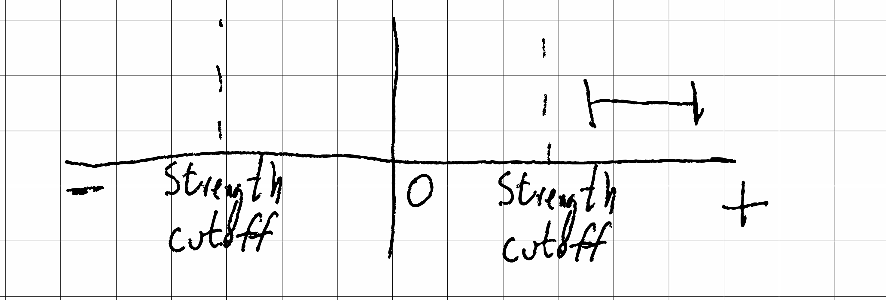
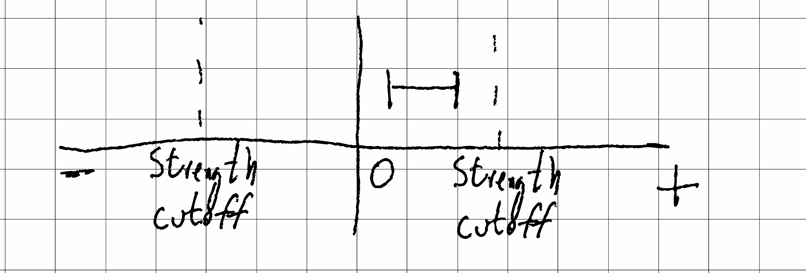
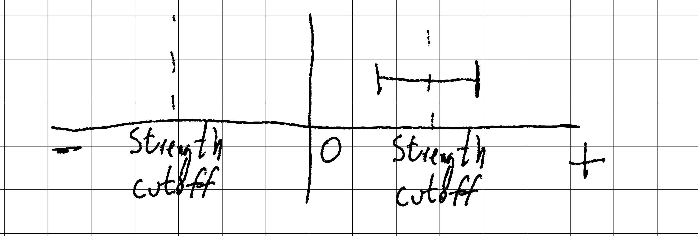
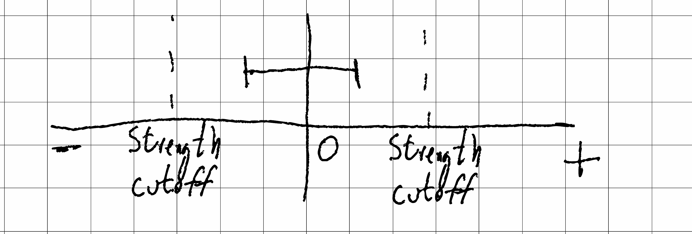
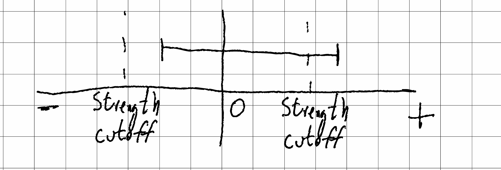
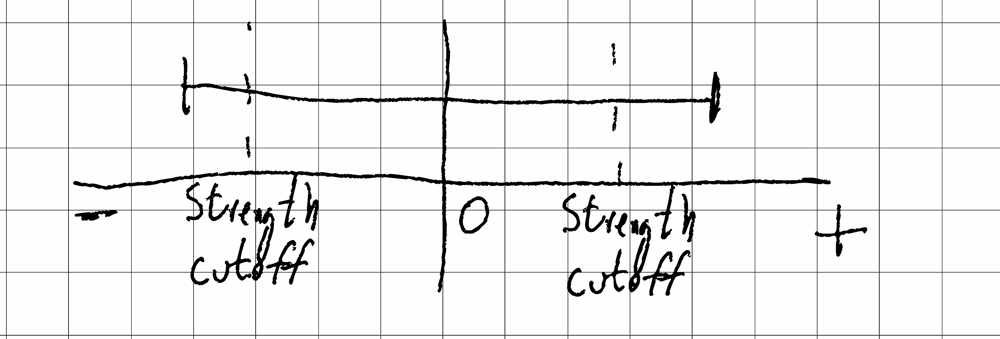

If we use statistics to infer whether an effect is large, we need a _prior_ specification of what we mean by large. There are then 6 possible ways the CIs can play out for a single estimand (after collapsing symmetries). What are good ways to describe them?

Here are some suggestions. I am interested in comments and other suggestions.

A. The effect is clearly large and positive.

B. The effect is clearly small and positive.

C. The effect is clearly positive; it is not clear whether it is large

D. The effect is clearly small; it is not clear whether it is positive

E. We can only rule out a large, negative effect.

F. Next time, we will definitely do a power analysis before conducting a study ☺

